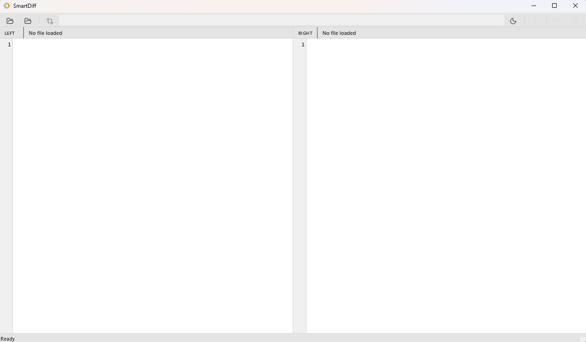
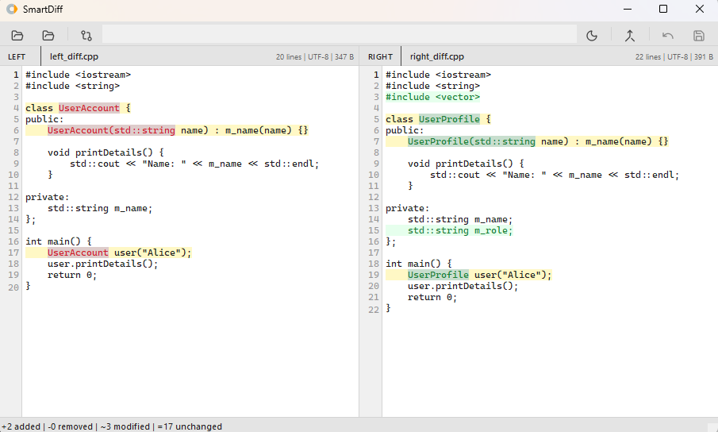
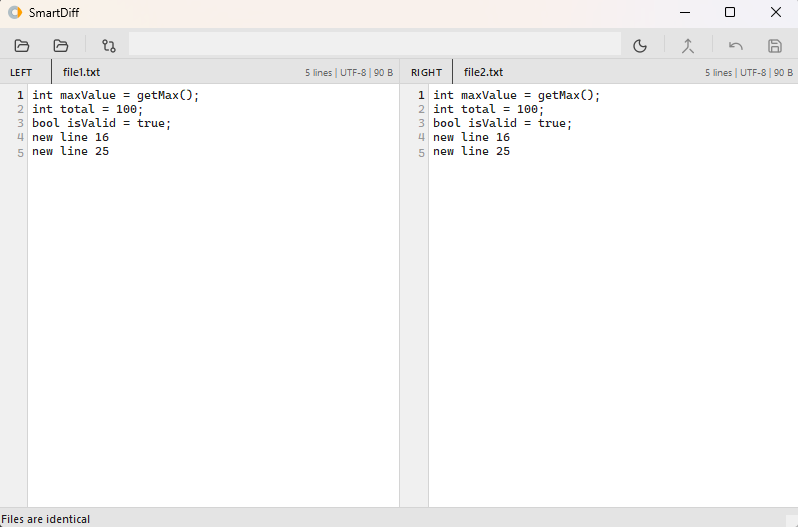
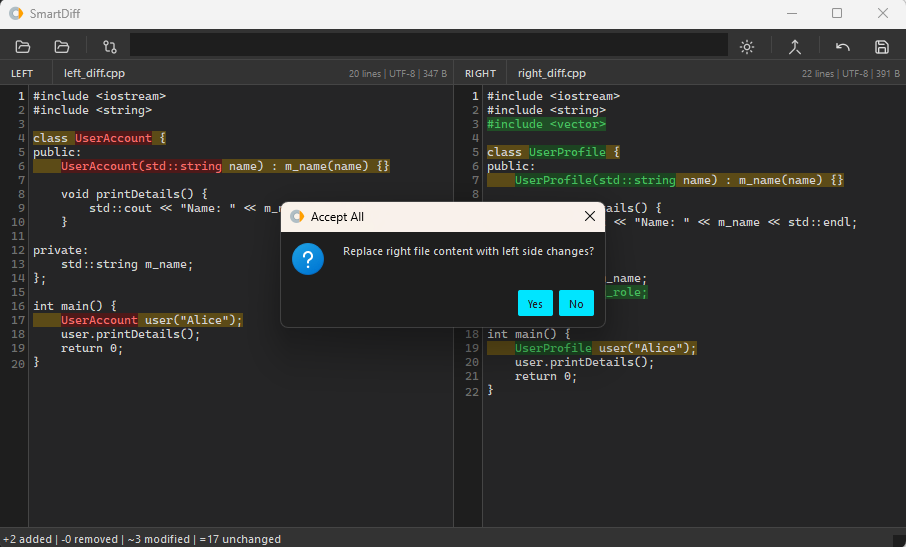
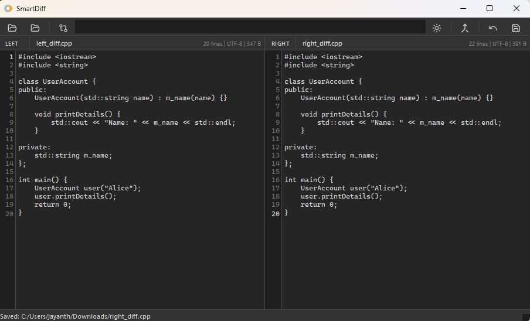

# SmartDiff

[cite_start]SmartDiff is a professional, minimalistic C++ desktop application built with **Qt 6.7.3** for high-performance file comparison and merging.

## Key Features

* **Advanced Diff Engine**: Implements the **Bounded Myers Shortest Edit Script (SES)** algorithm with **Prefix/Suffix optimization** for efficient processing of large files.
* **Word-Level Highlighting**: Pinpoints exact intra-line changes (additions/removals) for precise code review.
* **Neutral Design System**: Features a classic, professional UI with clinical light and IDE-neutral dark themes.
* **Synchronized Scrolling**: Perfectly linked editor views with a re-entrancy guard to prevent feedback loops.
* **One-Click Merge**: Rebuilds documents instantly using the **Merge Engine**'s "Accept All" strategy.

## Screenshots

### Comparison View
Observe identical vs. unidentical blocks with a sharp, compact brand aesthetic.

| Unidentical (Light) | Identical (Light) |
| :--- | :--- |
|  |  |

### Merging & Saving
High-contrast neon cyan accents guide the merging process in Dark Mode.

| Merging Files | Saving Results |
| :--- | :--- |
|  |  |

## Tech Stack

* **Language**: C++17
* [cite_start]**Framework**: Qt 6.7.3 (Widgets, SVG) 
* **Build System**: qmake